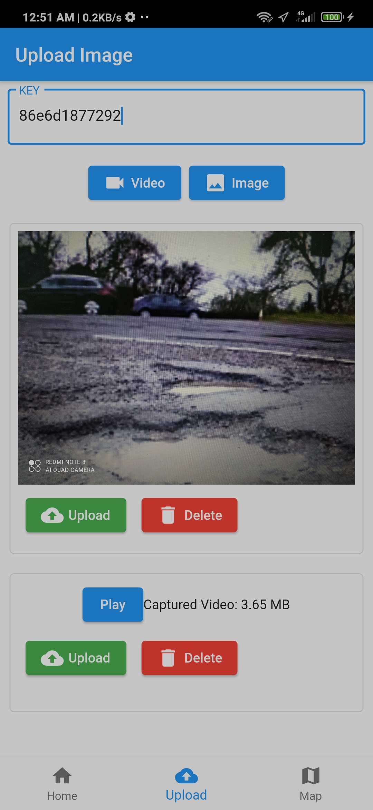
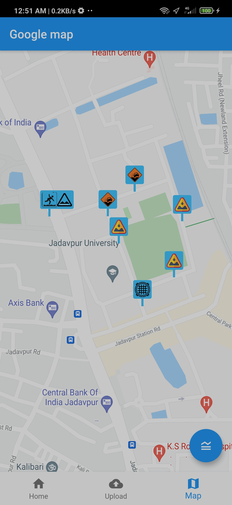
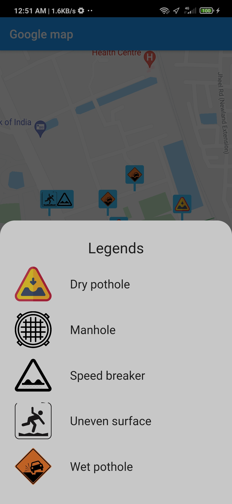
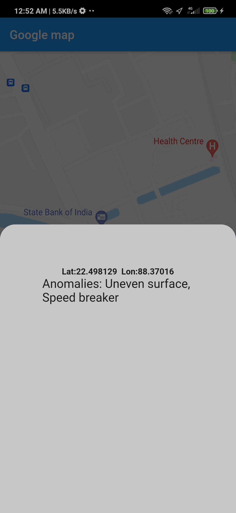

# Road_Anomalies_Detection

Through this app we are trying to track road anomalies. This repo contains the front end code for flutter application. Firebase is used to save corresponding data.

Back end api and ML program to detect anomalies in user given image/video is thoroughly researched and implemented by [Swadesh Jana](https://github.com/Swadesh13).

## Description
App has two main pages.
1) UPLOAD: Here user can upload the image/video of anomalies and location will be recorded live. It will be then processed in backend, if anomalies is detected then that/those location(s) will be marked in the map. Here key is the first part of ngrok server link where the backend is hosted.
2) Map: Here in google map , previously found anomalies are shown to alert the user about the road.

## Screenshots
#### Upload page

#### Map page

